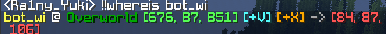

**简体中文** | [English](README.md)

Where Is
-------

一个 [MCDReforged](https://github.com/Fallen-Breath/MCDReforged) 的插件, 受到 [Fallen_Breath](https://github.com/Fallen-Breath) 的 [Here](https://github.com/TISUnion/Here) and [Ivan-1F](https://github.com/Ivan-1F) 的 [Where](https://github.com/Ivan-1F/MCDReforged-Plugins/tree/master/where) 启发

## 依赖

[MinecraftDataAPI](https://github.com/MCDReforged/MinecraftDataAPI/)

[MCDReforged](https://github.com/Fallen-Breath/MCDReforged) >= 2.12.0

> 于 2.2 版本变更: 
> 
> 不再支持 MCDR 2.11 及更早版本

## 指令

1. `!!whereis` 或者 `!!vris`（可在配置文件中修改）：显示一个其他玩家的坐标。

指令格式: `!!whereis <玩家> [参数(可选)]` （可以写多个玩家）

​	可选参数可以为以下值（多个参数使用空格隔开）：

​	`-a`, `--all` 意为向所有玩家发送坐标并高亮该玩家

​	`-s`, `--sudo` 意为提权，允许查看受保护的玩家的坐标

​	两个参数均需要插件配置中设置的 `admin` 等级来执行

> 于 2.2 版本变更:
> 
> 不再支持 `-as` 或 `-sa` 形式的参数，允许添加多个玩家

2. `!!here` （可在配置文件中修改）: 广播自己当前的坐标

> 2.1 新版功能:
> 
> 在启用了配置项的情况下, 聊天行中空格隔开的 `!!here` 指令可以被响应

两条指令均可使用的可选参数: (对行中 `!!here` 无效)

​	`-h`, `--highlight` <时长> 设定目标玩家的高亮时长

> 其位置仅被查询而非被广播的情况下，不能高亮玩家

> 2.2 新版功能:
> 
> 引入了新可选参数 `-h <duration>`

## 配置文件

部分特性可由配置文件控制，默认自动生成于 `config/where_is/config.json`。

修改配置文件之后需要使用`!!MCDR plg reload where_is`重载方可生效。

以下为配置文件内容

> [!WARNING]
> 下方被星号标记的两项的值须在更新到2.x版本前手动配置，否则您将在加载新版本时丢失本插件的全部配置，若您此前从未安装过本插件可无视该条信息

| 键                                | 值的类型                           | 默认值      | 说明                                                                                       |
|----------------------------------|--------------------------------|----------|------------------------------------------------------------------------------------------|
| `enable_where_is`                | `bool`                         | `true`   | 设置为`true`以启用查询玩家坐标的功能                                                                    |
| `enable_here`                    | `bool`                         | `true`   | 设置为`true`以启用广播自己坐标的功能                                                                    |
| `enable_here`                    | `bool`                         | `false`  | 设置为 `true` 以允许聊天中任意 here 指令解析功能                                                          |
| *`command_prefix`                | `dict`(含固定的2个项目)               | 见下表      | 插件指令前缀                                                                                   |
| `broadcast_to_console`           | `bool`                         | `true`   | `!!here` 或 `!!vris <player> -a` 会将坐标信息同时显示在服务端控制台                                        |
| `permission_requirements`        | `dict`(含固定的3个项目)               | 见下表      | 指令要求的最小权限等级                                                                              |
| *`hightlight_time`               | `dict`(含固定的2个项目)               | 见下表      | 当包含 `-a` 参数时高亮玩家的时间                                                                      |
| `display_waypoints`              | `dict`(含固定的2个项目)               | 见下表      | 是否显示小地图坐标点                                                                               |
| `query_timeout`                  | `int`                          | `3`      | Minecraft Data API的超时时间                                                                  |
| `click_to_teleport`              | `bool`                         | `true`   | 允许玩家点击补全传送指令 (仍需OP以执行)                                                                   |
| `location_protection`            | `dict`(含固定的5个项目)               | 见下表      | 玩家坐标保护相关设定                                                                               |
| `dimension_translation_mode`     | `Literal['mcdr', 'minecraft']` | `'mcdr'` | `mcdr`: 维度名称由MCDR翻译; `minecraft`: 维度名称由Minecraft翻译。在1.19及以上版本，用`mcdr`项可以避免因翻译键名改动造成的翻译失败 |
| `custom_dimension_name`          | `Dict[str, Dict[str, str]`     | 内容过长不便展示 | 由 MCDR 翻译的维度名称的翻译键值映射。首层键名为语言，二级键名为维度ID（支持非原版维度，原版维度必须填写且应去掉命名空间）                        |
| `custom_vanilla_translation_key` | `Dict[str, str]`               | 内容过长不便展示 | 由 Minecraft 翻译的维度键名映射 （支持非原版维度，原版维度必须填写且应去掉命名空间）.                                        |

> 2.1 新版功能:
> 
> 新的配置项目: `inline_here` 和 `custom_vanilla_translation_key`

上述提到的含固定键值对的的配置项如下:

**上述星标项的配置内容：**

| `command_prefix` 的键 | 值类型         | 默认值                       | 说明          |
|---------------------|-------------|---------------------------|-------------|
| `where_is`          | `List[str]` | `['!!vris', '!!whereis']` | 查询玩家坐标的指令前缀 |
| `here`              | `List[str]` | `['!!here']`              | 广播自己坐标的指令前缀 |

| `highlight_time` 的键 | 值类型   | 默认值  | 说明                     |
|---------------------|-------|------|------------------------|
| `where_is`          | `int` | `0`  | 当查询其他玩家并广播其坐标时玩家被高亮的时长 |
| `here`              | `int` | `15` | 当广播自己坐标时自己被高亮的时长       |

其余为常规项：

| `permission_requirements` 的键 | 值类型   | 默认值 | 说明                      |
|------------------------------|-------|-----|-------------------------|
| `where_is`                   | `int` | `1` | 允许查询其他玩家坐标的最小权限要求       |
| `here`                       | `int` | `0` | 允许广播自己的坐标的最小权限要求        |
| `admin`                      | `int` | `3` | 允许附带额外参数查询其他玩家坐标的最小权限要求 |

| `display_waypoints`的键 | 值类型    | 默认值    | 说明                                                                                                                     |
|-----------------------|--------|--------|------------------------------------------------------------------------------------------------------------------------|
| `voxelmap`            | `bool` | `true` | 为 `true` 时显示一个附带点击事件的文本 (`[+V]`) 点击高亮坐标，Ctrl点击添加坐标点到 [Voxelmap](https://www.curseforge.com/minecraft/mc-mods/voxelmap) |
| `xaero_minimap`       | `bool` | `true` | 为 `true` 时显示一个附带点击事件的文本 (`[+x]`) , 点击添加路径点到 [Xaero's Minimap](https://chocolateminecraft.com/minimap2.php)             |

| `location_protection` 的键 | 值类型    | 默认值                                                      | 说明                              |
|--------------------------|--------|----------------------------------------------------------|---------------------------------|
| `enable_whitelist`       | `bool` | `false`                                                  | 启用查询白名单，启用时限制白名单外的玩家被查询         |
| `enable_blacklist`       | `bool` | `true`                                                   | 启用查询黑名单，启用时限制黑名单内的玩家被查询         |
| `whitelist`              | `list` | 空列表                                                      | 白名单，限制除此之外的玩家被查询                |
| `blacklist`              | `list` | 空列表                                                      | 黑名单，限制该列表内的玩家被查询                |
| `protected_text`         | `dict` | `'en_us': 'He/She\'s in your heart!' 'zh_cn': 'Ta在你心里!'` | 当玩家被阻止查询时显示的信息，提供了MCDR语言偏好设置的支持 |

## 示例

